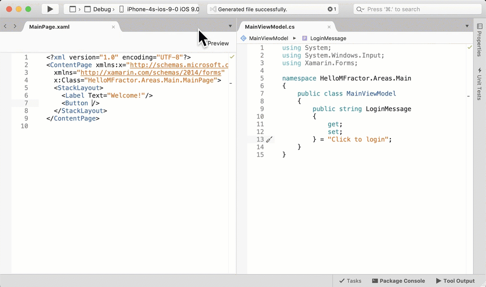

## Introduction

MFractor is a powerful Visual Studio for Mac extension to streamline the development of your Xamarin applications. By improving many common Xamarin workflows, MFractor can save a significant amount of development time and effort over the course of your project.

In this article I'll explore three of MFractors handiest features, the XAML editor, Image Manager and Font Importer, and how we can leverage them to save time and effort when building our Xamarin apps.

Let's get started by taking a look at the XAML editor.

## XAML Editor

Have you ever created a data-binding and ran your application only to discover you misspelt the property name? It's an annoying mistake and let's be honest, we've all done this! Wouldn't it be great if our ViewModel properties were included IntelliSense to prevent this?

ViewModel property IntelliSense is one of the many features in MFractors XAML editor. By automatically detecting the ViewModel for a XAML file, MFractor suggests your ViewModels properties in IntelliSense and even lets you generate properties and commands onto your ViewModel.

MFractor also checks binding expressions for many common issues (for example, does that property exist in the ViewModel?), provides detailed binding tooltips and includes navigation shortcuts to let you quickly move between your View and ViewModel.

The XAML editor also includes dozens of additional completions, 70+ XAML inspections, insightful tooltips, navigation shortcuts and 50+ XAML refactorings to make editing XAML faster and easier.

For example, MFractor can suggest image assets, static and dynamic resources, grid rows and columns and much more. Want to see what image is being used in XAML? Simply hover over the image to see a preview.

MFractors XAML editor is available for free in MFractor Lite; use it in up to 4 XAML files per day!

## Image Asset Management

Imagine that your designer has just handed you a bunch of image assets and now you need to add them to your Android and iOS projects. We'd have to copy each image into the different density folder and then manually add them one by one into our projects.

This highly manual process is a big and expensive time sink in app development.

To improve this workflow, MFractor's **Image Importer** can generate new images for the different densities from a source image. We choose a source image and the Image Importer will create a new version of that image for each density, place them into the correct folders and add them to our Android and iOS projects.

The Image Importer is just one of many features included in MFractors Image Manager, a useful tool to simplify image resource management for your iOS and Android projects.

We can access the Image Manager by going to the *MFractor* menu in the top menu bar and choosing *Manage Image Assets*.

The Image Manager gives a 'birds-eye' view of all the images across your application, grouping them by name in the left list and displaying a preview of that asset, enabling you to visually explore the images in your projects.

The Image Manager can:
 * Delete all occurrences of an image from your app. Right click on an image, choose Delete and MFractor will remove all densities from your Android and iOS projects.
 * Optimise your image assets using TinyPNG; this can save 30-70% of the final size of each image in your app.
 * Show you a preview of an image asset when you are choosing an image through XAML IntelliSense.
 * Open image assets within the IDE. Double click on an Android or iOS image  to open it in the Image Manager.
 * And much, much more.

You can learn more about the Image Manager in our [Simplified Image Asset Management for Xamarin Apps](https://www.mfractor.com/blogs/news/simplified-image-asset-management-for-xamarin-apps) blog post.

The Image Manager is available in MFractor Professional.

## Font Importer

Custom fonts are one of the back-bones of modern app development; they are critical to an apps branding and fonts like FontAwesome are often used  for iconography.

To use a font in Xamarin.Forms, we include add the font to our Android and iOS projects, update the Info.plist for iOS and then use the FontFamily property to apply the fonts in XAML. All in all, it's a lot of manual work and it's very easy to miss a step and then spend an hour debugging and fixing it.

Instead of doing this fiddly work, we can use MFractors **Font Importer** to add a ttf or otf file into our Android an iOS projects. This handy tool adds the new font in each project, creates an Info.plist entry in any iOS projects and generates the font lookup XAML ready for us to use:

Access the Font Importer through the top **MFractor** menu and then choosing **Import**, **Font**.

You can learn more about the Font Importer in our [Using Custom Fonts In Xamarin.Forms](https://www.mfractor.com/blogs/news/using-custom-fonts-in-xamarin-forms) blog post.

The Font Importer is available in MFractor Professional.

## Summary

MFractor is available in two flavours; Lite (free) and Professional (paid).

MFractor Lite is fantastic value by enabling our XAML Editor in four files per day. You can use MFractors XAML IntelliSense to gain ViewModel property code completion, use 70+ code inspections to spot a range of common issues, 50+ code actions, detail tooltips and navigation shortcuts.

If you want even more powerful features, upgrade to MFractor Professional to use the [Image Importer and Image Manager](https://www.mfractor.com/blogs/news/simplified-image-asset-management-for-xamarin-apps), the [Font Importer](https://www.mfractor.com/blogs/news/using-custom-fonts-in-xamarin-forms), the [MVVM Wizard](https://www.mfractor.com/blogs/news/generating-viewmodels-in-xamarin-forms-with-the-mvvm-wizard) and for unrestricted access to our XAML editor.

To get MFractor, open the Extension Manager using the Extensions item in the main Visual Studio menu and under **Gallery** and **IDE Extensions** choose MFractor and then install.

To learn more about about MFractor, head to www.mfractor.com.

PS: Use the discount code **MFRACTOR-101** to take 10% off MFractor Professional 😉

